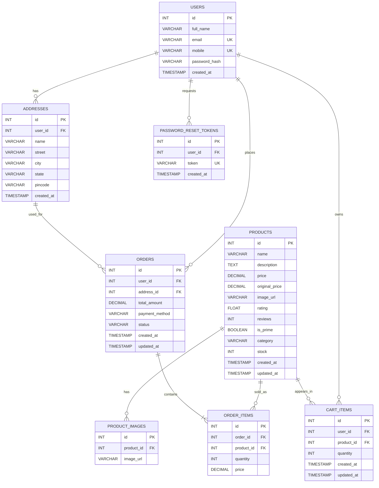

# Shopzi ER Diagram

## Relationship Summary

- One user can save many addresses, cart items, orders, and password reset tokens.
- One product can have many image records, cart entries, and order item records.
- One order belongs to one user and one delivery address.
- One order contains one or more order item rows.
- `order_items.price` stores the product price at purchase time so old orders keep their original price even if the product price later changes.
